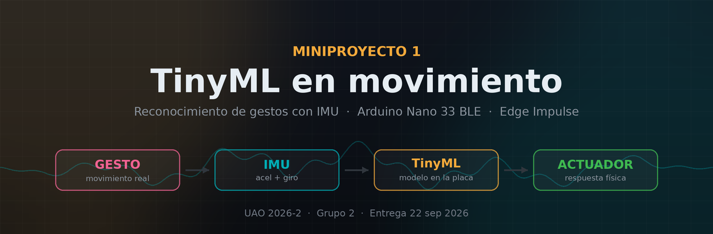

<div align="center">



### 🍸 IA en Dispositivos Móviles y Embebidos · UAO 2026-2 · Grupo 2


**César Reyes** · **Juan Camilo Díaz Rangel** · **Sebastián Santana**  
Profesor: Juan Camilo Giraldo Londoño

</div>

---

# 🍸 Proyecto seleccionado: Bartender TinyML

La idea elegida es una **coctelera inteligente** que reconoce movimientos reales de coctelería con un sensor inercial y utiliza TinyML para identificar el gesto que está realizando el usuario.

La experiencia se inspira en la lógica de juegos de cocina paso a paso: la app indica qué hacer, la coctelera mide **cómo se hizo** y el sistema muestra el resultado en tiempo real.

> Nombre visual provisional: **MixLab** — *Cooking Mama, pero de cócteles*.

## 🎯 Objetivo del MVP

El foco principal ya no es mover servos o relés alrededor del vaso. El dispositivo debe funcionar como un **módulo autónomo de adquisición + inferencia + comunicación**:

1. El IMU del Arduino captura acelerómetro y giroscopio.
2. El modelo TinyML reconoce el movimiento.
3. La placa envía por **BLE** la clase y su confianza.
4. La **app** representa la receta, el paso actual, temporizador, precisión y progreso.
5. Una OLED y un RGB pueden dar feedback local básico, pero no sustituyen la interfaz de la app.

```text
   🍸 COCTELERA INSTRUMENTADA
   ┌────────────────────────────────────────┐
   │ Arduino Nano 33 BLE                    │
   │ IMU → modelo TinyML → clase/confianza  │
   │ OLED / RGB (feedback local opcional)   │
   │ batería interna + carga USB-C           │
   └──────────────────┬─────────────────────┘
                      │ BLE
                      ▼
   📱 APP / TABLET
   ┌────────────────────────────────────────┐
   │ Recetas · Entrenar · Jugar · Progreso  │
   │ gesto actual · tiempo · confianza       │
   │ feedback y puntuación                   │
   └────────────────────────────────────────┘
```

---

## 🤲 Clases de movimiento

Dataset propio con **5 clases + reposo**:

| # | Clase | Movimiento | Firma esperada del IMU |
|:-:|---|---|---|
| 1 | `agitar` | Shake de coctelera | Oscilación fuerte y periódica |
| 2 | `remover` | Stir con cuchara | Rotación suave y sostenida |
| 3 | `servir` | Inclinar para verter | Inclinación mantenida y estable |
| 4 | `macerar` | Golpes verticales cortos | Impactos repetidos sobre un eje dominante |
| 5 | `colar` | Giro/inclinación final | Cambio angular marcado y parada |
| 6 | `reposo` | Coctelera quieta | Varianza mínima; solo gravedad |

El principal riesgo de clasificación sigue siendo separar `agitar` de `macerar`; se trabajará con acelerómetro + giroscopio, eje dominante, frecuencia y ventanas de aproximadamente 1–2 s.

---

## 📱 Concepto de la app

La interfaz se plantea como una experiencia lúdica de aprendizaje de coctelería:

- **Recetas:** elegir el cóctel y ver los pasos.
- **Entrenar gestos:** practicar cada movimiento de forma individual.
- **Jugar:** completar la receta en secuencia y recibir puntuación.
- **Progreso:** historial, precisión y mejores resultados.
- **Modo en vivo:** gesto solicitado, temporizador, confianza del modelo y estrellas/puntuación.

La idea es que una tablet pueda mostrar el menú general mientras un teléfono muestra el paso activo durante la preparación.

---

## 🔧 Hardware del módulo lateral

El módulo se monta en un costado de la coctelera mediante abrazaderas o velcro, sin perforar el recipiente.

| Componente | Rol |
|---|---|
| **Arduino Nano 33 BLE / Rev2** | Procesamiento, IMU, TinyML y BLE |
| **OLED SSD1306 0.96" I²C** | Feedback local opcional |
| **WS2812B RGB** | Estado de conexión/captura opcional |
| **LiPo 3.7 V ~1000 mAh** | Alimentación autónoma |
| **TP4056 USB-C con protección** | Recarga de la batería |
| **MT3608 Step-Up** | Conversión de tensión |
| **Interruptor ON/OFF** | Encendido físico |
| **Conector JST** | Batería desmontable |
| **Carcasa 3D + abrazaderas** | Protección y fijación lateral |
| **Cableado/conectores** | Integración del prototipo |

👉 Presupuesto detallado y enlaces de compra: [`docs/materiales.md`](docs/materiales.md)

### 💰 Presupuesto de referencia

- **Todo desde cero:** ~**$337.951 COP**
- **Reutilizando el Nano 33 BLE del grupo:** ~**$177.469 COP**
- **MVP mínimo sin OLED ni RGB, reutilizando Arduino:** ~**$133.569 COP**
- **MVP mínimo + margen:** ~**$158.569 COP**

Los precios son aproximados y pueden cambiar en Mercado Libre.

---

## ⚠️ Punto que debemos validar con el profesor

La guía actualmente guardada en [`docs/requisitos.md`](docs/requisitos.md) indica **un actuador distinto por clase** y que los LEDs no cuentan. La arquitectura seleccionada está centrada en captura, inferencia y representación en la app, así que este punto debe confirmarse antes de eliminar formalmente los actuadores del alcance evaluable.

Lo mismo aplica al **comodín de la app móvil**: si la app cuenta como parte obligatoria del MVP, se consumiría aquí.

---

## 🧠 Pipeline TinyML

```text
Captura IMU
   ↓
Dataset propio — 3 integrantes
   ↓
Edge Impulse
   ↓
Procesamiento / features
   ↓
Clasificador TinyML
   ↓
Arduino Nano 33 BLE
   ↓
clase + confianza
   ↓ BLE
App móvil / tablet
```

El proyecto de Edge Impulse debe quedar **público** y su enlace irá tanto en este repositorio como en el paper IEEE.

---

## 🔬 Estado del arte

La investigación previa está en [`research/estado-del-arte.md`](research/estado-del-arte.md). Los antecedentes encontrados indican que gestos como servir, agitar y remover son reconocibles mediante IMU, pero hay mucho menos trabajo en un **tutor embebido de coctelería completo**, que es donde está el aporte del proyecto.

---

## 📋 Requisitos de entrega

- Dataset propio con sensor inercial.
- 5 clases de movimiento + `reposo`.
- Entrenamiento en Edge Impulse.
- Sistema autónomo: sin depender del PC para energía o ejecución.
- MVP funcional.
- Paper en formato IEEE.
- Código fuente.
- Sustentación ≤15 min.
- Validar con el profesor el requisito de actuadores y el uso del comodín de app.

---

## 🗂️ Estructura

```text
📁 docs/       Requisitos + materiales y presupuesto
📁 ideas/      Propuestas originales + diseño ganador
📁 research/   Estado del arte y referencias
📁 decision/   Matriz y decisión del grupo
📁 assets/     Banner y diagramas del proyecto
```

<div align="center">

### 🍹 *La app te dice qué hacer. La coctelera entiende cómo lo hiciste.*

**Grupo 2 · UAO 2026-2**

</div>
